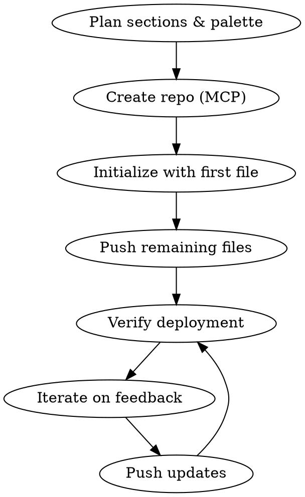

# Portfolio Website Creation via GitHub MCP

## Overview

Build and deploy a single-page static portfolio site (HTML/CSS/JS, no build step) to GitHub Pages using GitHub MCP tools. Covers design, implementation, deployment, and iteration — all without a local git clone.

## Workflow



### Step 1: Create Repository

```
mcp: create_repository(name="username.github.io", private=false, autoInit=false)
```

**Gotcha — empty repo initialization:** `push_files` fails on repos with zero commits (`409 Git Repository is empty`). You must first create a single file with `create_or_update_file` to establish the initial commit, then use `push_files` for the remaining files.

```
# First: initialize repo with one file
mcp: create_or_update_file(path="index.html", ...)

# Then: push the rest in one commit
mcp: push_files(files=[{style.css}, {script.js}], ...)
```

### Step 2: Build Files

Three files, no dependencies:

| File | Role |
|------|------|
| `index.html` | Semantic HTML5, all content, meta/OG tags, font imports |
| `style.css` | Custom properties, layout, responsive breakpoints, animations |
| `script.js` | IntersectionObserver reveals, scroll effects, touch handling |

### Step 3: Iterate via MCP

For subsequent updates, use `push_files` with all changed files in one commit. Always provide the full file content (MCP replaces entire files, not diffs). Use `get_file_contents` to read current state before editing, and pass the `sha` to `create_or_update_file` when updating a single file.

## Design System

### Color Palette (Dark Navy-Gray)

Avoid pure black (`#000000`). A dark navy-gray base feels more alive:

| Token | Value | Usage |
|-------|-------|-------|
| `--bg` | `#0d1117` | Page background (GitHub dark theme base) |
| `--surface` | `#161b22` | Cards, nav, elevated surfaces |
| `--border` | `#21262d` | Dividers, card borders |
| `--text` | `#d1d5db` | Primary text (never pure white) |
| `--text-muted` | `#6b7280` | Secondary text |
| `--accent` | `#9ca3af` | Hover states, links |
| `--glow-color` | `rgba(99,102,241,0.08)` | Card glow, subtle highlights |

Add radial gradient pools on `body` for depth:
```css
body {
    background-color: var(--bg);
    background-image:
        radial-gradient(ellipse at 15% 50%, rgba(99,102,241,0.04) 0%, transparent 50%),
        radial-gradient(ellipse at 85% 20%, rgba(59,130,246,0.03) 0%, transparent 50%);
}
```

### Typography

Pair a distinctive display font with a clean body font. Avoid generic choices (Inter, Roboto, Arial).

- **Display:** Syne (800wt for headings — geometric, architectural feel)
- **Body:** Outfit (300-500wt — clean geometric sans)

Load via Google Fonts with `preconnect` for performance.

### Visual Effects Stack

Layered subtle effects that compound into a premium feel:

1. **Film grain overlay** — SVG `feTurbulence` noise at 4% opacity, `position: fixed`, `pointer-events: none`, `z-index: 9999`. Adds analog warmth.
2. **Floating gradient orbs** — 2 large blurred circles (`filter: blur(100px)`) with slow 25-30s float animations. Different durations so they never repeat visually. Keep opacity at 0.08-0.12.
3. **Scroll progress bar** — 2px fixed gradient line at top, width driven by JS scroll calculation.
4. **Cursor-following card glow** — `::before` pseudo-element with `radial-gradient` positioned at `var(--mouse-x) var(--mouse-y)`, updated via `pointermove`. Inspired by Linear/Vercel.
5. **Alternating section backgrounds** — `main > .section:nth-child(even)` gets semi-transparent surface color.
6. **Gradient section dividers** — `::before` pseudo-element on adjacent sections with a centered gradient line.
7. **Staggered scroll reveals** — IntersectionObserver on sections; children get incremental `transition-delay` (0.08s per item).

## Mobile Parity

Half or more of portfolio viewers are on mobile. Every desktop effect needs an equivalent:

| Effect | Desktop | Mobile Adaptation |
|--------|---------|-------------------|
| Card glow | `pointermove` tracking | `touchstart`/`touchmove`/`touchend` + `.touch-active` class |
| Grain overlay | 4% opacity | 3% opacity + `will-change: transform` + `translateZ(0)` for GPU compositing |
| Ambient orbs | 600/500px, blur 100-120px | 350/280px, blur 80px, 70% opacity |
| Card glow radius | 500px | 300px (proportional to mobile cards) |
| Scroll reveals | Same | Same (IntersectionObserver works on mobile) |
| Progress bar | Same | Same (scroll event fires on touch scroll) |

### Key Mobile CSS

```css
/* GPU compositing for iOS Safari */
body::before { will-change: transform; transform: translateZ(0); }
.orb { will-change: transform; transform: translateZ(0); }

/* Disable native tap highlight */
.card, .nav-toggle, .hero-link { -webkit-tap-highlight-color: transparent; }

/* Touch-active states mirror :hover */
.card.touch-active { border-color: rgba(99,102,241,0.25); transform: translateY(-3px); }
.card.touch-active::before { opacity: 1; }
```

### Key Mobile JS

```javascript
card.addEventListener('touchstart', (e) => {
    const touch = e.touches[0];
    const rect = card.getBoundingClientRect();
    card.style.setProperty('--mouse-x', (touch.clientX - rect.left) + 'px');
    card.style.setProperty('--mouse-y', (touch.clientY - rect.top) + 'px');
    card.classList.add('touch-active');
}, { passive: true });

card.addEventListener('touchend', () => card.classList.remove('touch-active'), { passive: true });
card.addEventListener('touchcancel', () => card.classList.remove('touch-active'), { passive: true });
```

### Accessibility

```css
@media (prefers-reduced-motion: reduce) {
    *, *::before, *::after {
        animation-duration: 0.01ms !important;
        transition-duration: 0.2s !important;
    }
    .reveal { opacity: 1; transform: none; }
    .orb { animation: none; }
    html { scroll-behavior: auto; }
}
```

JS should also check `window.matchMedia('(prefers-reduced-motion: reduce)').matches` and skip animation setup.

## Section Patterns

| Section | Layout | Key CSS |
|---------|--------|---------|
| Hero | Centered, full viewport, grid background | `min-height: 100vh`, CSS grid overlay with radial mask |
| About | Single paragraph, max-width | `max-width: 720px`, `font-weight: 300`, `line-height: 1.8` |
| Experience | Vertical timeline | `padding-left: 32px`, `::before` vertical line, absolute-positioned dots |
| Projects | 2-col card grid (1-col mobile) | `grid-template-columns: repeat(2, 1fr)`, glow + lift on hover |
| Education | 3-col cards (responsive) | `repeat(3, 1fr)` → `repeat(2, 1fr)` → `1fr` |
| Publications | Stacked cards | `flex-direction: column`, `gap: 20px` |
| Skills | Chip/tag groups | `flex-wrap: wrap`, `gap: 8px`, border glow on hover |

## Common Mistakes

- **Pure black background** — Use `#0d1117` (dark navy-gray) instead of `#000000`. The subtle blue undertone feels more alive.
- **Forgetting empty repo workaround** — `push_files` needs at least one commit. Use `create_or_update_file` first.
- **`position: fixed` on iOS** — Always add `will-change: transform` and `translateZ(0)` to fixed overlays (grain, orbs) to force GPU compositing.
- **No touch events for hover effects** — Mobile has no hover. Add `touchstart`/`touchend` handlers with matching CSS classes.
- **Ignoring `prefers-reduced-motion`** — Always provide a reduced-motion fallback. Show all content immediately, disable animations.
- **Full white text** — Use `#d1d5db` (slightly muted) instead of `#ffffff`. Never pure white on dark backgrounds.
- **Generic fonts** — Avoid Inter, Roboto, Arial. Pick distinctive pairings (Syne + Outfit, Bricolage Grotesque + DM Sans, etc.).
